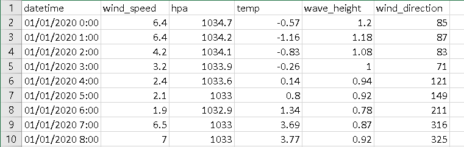
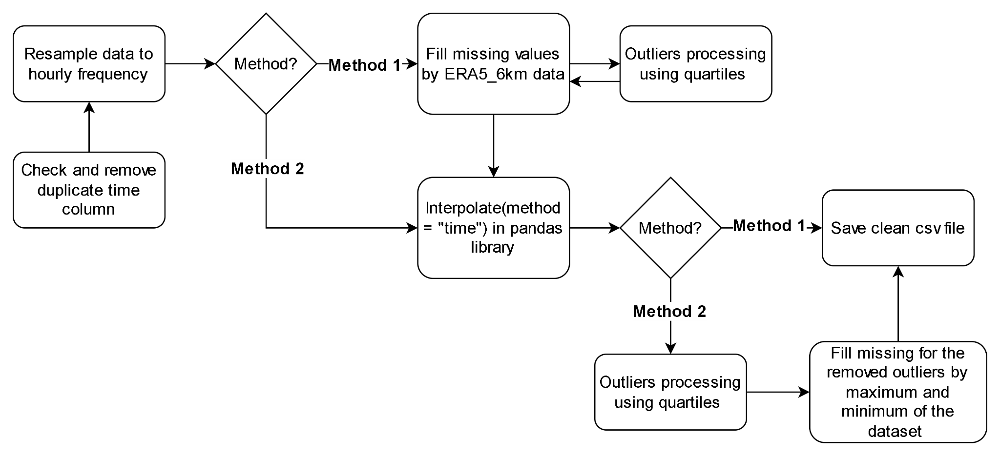

## Dataset
The dataset we used in the experiment is the TW_79 dataset, which consists of six variables: datetime, wind speed, wind direction, temperature, atmospheric pressure, and wave height. The raw data was collected from 2020/01/01 to 2023/02/16, with a time-frequency of 10 minutes. After analyzing the dataset, we found that it had duplicate, missing values, and some variables had a large number of missing values after 2022. Therefore, we only used the data from 2020/01/01 to 2022/12/31 in our experiment. The figure below shows the steps we took to preprocess the TW_79 dataset.

## Data Preprocessing

Data pre-processing framework

**Step 1**: Remove duplicate rows based on the datetime column.

**Step 2**: Resample data to hourly frequency. Since the dataset starts from 2020/01/01 00:00, we used the resampling method based on the first hour of each interval, meaning that if the data had a finer resolution than hourly, the odd times (minutes different from zero) would be discarded, and only the values recorded exactly at their hour would be kept. For example, if there were two rows with 2020/01/01 00:00 and 2020/01/01 10:00, the row with 2020/01/01 10:00 would be removed.

**Step 3**: Handle missing and outlier values. In this step, we used two methods to handle missing and outlier values. The details of each method are presented in steps 3.1 and 3.1’ corresponding to method 1 and method 2 in Figure **Data pre-processing framework**.

**Step 3.1**: The missing values in the data after resampling to hourly frequency were filled with the corresponding values in the complete data set ERA_6km (distance is 6km from the target point, TW_79). Then, the outlier values were detected when they were greater than the upper bound (Q3 + 1.5I*QR) or lower than the lower bound (Q1 - 1.5*IQR). Where Q1 is the first quartile or the 25th percentile of a dataset, which means that 25% of the data is below this value. Q3 is the third quartile or the 75th percentile of a dataset, which means that 75% of the data is below this value. IQR is the interquartile range, which is the difference between Q3 and Q1. It measures the spread of the middle 50% of values in a dataset. The values detected as outliers were removed and filled with the ERA5_6km dataset for the wind speed variable again. Finally, since the ERA5_6km has only wind speed data, other missing values of the remaining variables in TW_79 (exclude wind speed) need to be filled in missing values. In this phase, we used the interpolate function in the “pandas” library with parameter method = “time”.

**Step 3.1’**: The dataset was filled with the interpolate function in the “pandas” library with parameter method = “time”. Next, the outlier values were detected when they were greater than the upper bound (q3 + 1.5IQR) or lower than the lower bound (q1 - 1.5IQR). Finally, fill in the removed outliers. If over the upper bound then fill by the upper bound value. Else if lower than the lower bound then fill by the lower bound value.

**Step 4**: After the data was cleaned through the steps of removing duplicates, and handling missing and outlier values, the data was ready to be saved for use in the training and evaluation process.
