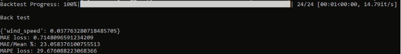

# Experiment Guide

This guideline provides a step-by-step approach to running the experiment, including installation, data preparation, model training, and parameter information.

## Requirements

- Python >= 3.7
- PaddlePaddle
- PaddleTS

## Installation

Follow the steps below to install the necessary packages for the experiment.

### Table 1. Installation Script for PaddleTS Informer

| NO. | Step                                 | Script                                                                                       |
|-----|--------------------------------------|----------------------------------------------------------------------------------------------|
|  1  | Create a virtual environment using Conda | `conda create -n paddlets python=3.9`                                                         |
|  2  | Activate the new environment           | `conda activate paddlets`                                                                     |
|  3  | Install PaddlePaddle                   | `python -m pip install paddlepaddle==2.5.0 -i https://pypi.tuna.tsinghua.edu.cn/simple`       |
|  4  | Install PaddleTS                       | `python -m pip install paddlets`                                                              |

For detailed installation instructions, refer to the installation guide [here](https://paddlets.readthedocs.io/en/stable/source/installation/overview.html)

In addition, you need to install additional packages in this requirement.txt file to ensure that the installation is complete. From the virtual environment, enter:
``` diff
-	pip install -r requirement.txt
```
## Data Preparation
**Note: In the experiment process, we have done this step for you so you can skip the steps below.**

In this step, we need to perform the data cleaning operations. In the Informer on numerical data experiment. The steps include: Remove duplicates, resampling data to hourly frequency, Handle missing by ERA_6km for wind speed variable, and interpolating function for remaining variables. The outlier values were detected by being over the upper bound (Q3 + 1.5IQR) or lower than the lower bound (Q1 - 1.5IQR). To do this, we need: 

-	Step 1: From the anaconda virtual environment that was installed (paddlets): point to the package folder A2M_Data.
-	Step 2: Type the command: python DataProcessing.py 
-	Step 3: Point to the data_cleaned folder in the A2M_Data folder to get the cleaned data named TW_0079_data_FillByERA5_Interpolate.csv. 
-	Step 4: We have finished preprocessing the data. Next is to save the cleaned dataset into the working space of the Informer model.

## Reproducibility 
After finishing the previous steps, the cleaned data will be in the working space of the Informer model. The folder below is where the cleaned data is stored:

-	data/A2M_TW79/TW_0079_data_FillByERA5_Interpolate.csv 

At prediction length, if you want to evaluate 30 validation dates, you need to change the argument “val_date” sequentially by 1, 2, 3, and so on, 30. For example, if you want to see the prediction results evaluated on the validation set on 2022/10/31 (1st validation date), then the argument “val_date” will be 1, similarly to see the prediction results evaluated on the validation set on 2022/11/29, then the argument “val_date” will be 30.

### Table 2. The Guideline Step for Reproducibility

| NO. | Step                                                                                       | Script                                                                                   |
|---------|------------------------------------------------------------------------------------------------|----------------------------------------------------------------------------------------------|
|   1 | Run model inference for A2M_TW79 dataset with the out chunk length = 1, validation date = 1 (2022/10/31) | `python Model_Inference.py --mode a2m_79 --out_len 1 --val_date 1`                             |
|   2 | Run model inference for A2M_TW79 dataset with the out chunk length = 1, validation date = 2 (2022/11/01) | `python Model_Inference.py --mode a2m_79 --out_len 1 --val_date 2`                             |
|   3 | Run model inference for A2M_TW79 dataset with the out chunk length = 4, validation date = 1            | `python Model_Inference.py --mode a2m_79 --out_len 4 --val_date 1`                             |
|   4 | Run model inference for A2M_TW79 dataset with the out chunk length = 6, validation date = 1            | `python Model_Inference.py --mode a2m_79 --out_len 6 --val_date 1`                             |

For more detailed parameter information, please refer to the Model_Inference.py file. The following parameters are available:
-	--mode: Mode of the dataset (default: "a2m_79")
-	--in_len: Number of input timesteps (default: 216)
-	--out_len: Output chunk length for model predictions (default: 1)
-	--val_date: The date in the dataset that the model was evaluation, must range from 1 to 30 (default: 1)

Below is an example result when running the Model_Inference.py with script: python Model_Inference.py --mode a2m_79 --out_len 1 --val_date 1. 



## Training Process
To train the model, enter the following script: 
-	python TW_ALL_Informer.py --dp a2m_79 --in_len 216 --out_len 1
For more detailed parameter information, please refer to the TW_ALL_Informer.py file. The following parameters are available:
-	--dp: Path to the dataset (default: "a2m_79")
-	--mp: Path to the model (default: "trained_models/informer/")
-	--in_len: Number of input timesteps (default: 216)
-	--out_len: Output chunk length for model predictions (default: 24)
-	--token_len: Start token length of Informer decoder (default: 4*24)
-	--d_model: Expected feature size for input/output of encoder/decoder (default: 32)
-	--n_head: Number of heads in the multi-head attention mechanism (default: 4)
You can also review the comparison between the actual and predicted values in the folder: results. Review the parameters and outcomes of the training process in the folder: training_backtest. The trained models will be saved in the folder: trained_models.

## For further details about the Informer model
-	Informer GitHub Repository: https://github.com/zhouhaoyi/Informer2020
-	PaddleTS Informer Documentation: https://paddlets.readthedocs.io/en/stable/source/api/paddlets.models.forecasting.dl.informer.html

